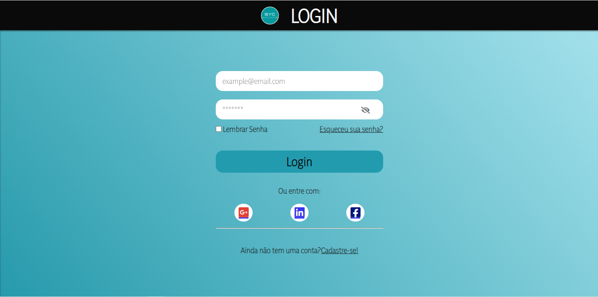
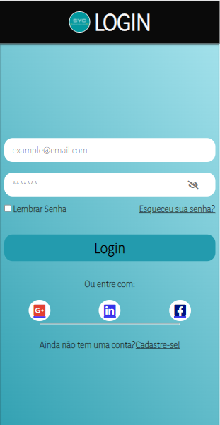

 ## Tela de Login 
> Tela de login feita para relembrar conceitos de html5 e css e javascript com responsividade (flexbox).

- Criado por: 
  - Maria Clara
  
- Tecnologias e linguagens utilizadas:
  - Html
  - Css
  - Javascript

 ## Imagem ao abrir o index do modo web:
 
 
 
 ## Imagem ao abrir o index no smartphone:
 
 
